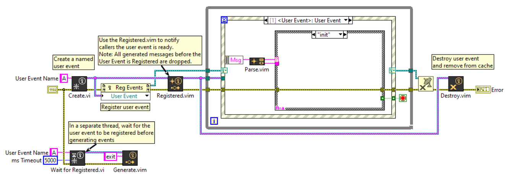

# LabVIEW User Event
 User Event library for LabVIEW

## Getting Started

Open and run the `/src/Demo.vi` to see an example on how to use this library.

## Overview

This **User Event** library expands on the built-in User Events functions by adding **Named User Events** and methods
to check if the User Event is **Registered for Events** prior to message generation so that events
are not dropped.

User Events in LabVIEW do not adhere to the same behavior as Queues, Notifiers, Semaphores, etc. in that
User Events are not named, drop all messages before the invoking the **Register for Events** and strictly type to event structures (not fully supported on Real-Time). This causes undesirable behavior in multi-threaded applciations where the user interface
may be separated from the processor/consumer loop (i.e. Queued Message Handlers).

Features:

- Named User Events
  - User Event functional global look up table to track names/references
- Malleable functions for `Generate`, `Registered`, `Status`, `Parse` and `Destroy`
  - Allows Enum or String messages + flattened data
  - Supports lookup by User Event reference or User Event Name
- Register for Events - Wait for Registered
  - Built-in function to set if the User Event has been `Registered` for events
  - Custom method to `Wait for Registered` to make sure the User Event is ready before Generating events

## Functions

### Create

The `Create.vi` function adds the ability to set the User Event's Name. A functional global stores the
user event reference to be recalled when referenced by name.

### Registered + Wait for Registered

A issue with User Events is that if the User Event has not `Registered for Events` before a
message is generated, the message is dropped (i.e. ignored). To avoid dropped messages during initialization,
this library adds the `Registered.vim` and `Wait for Registered.vi` to notify the callers that the User Event
is ready to accept messages.

Once the Named User Event is created and Registered for Events, call the `Registered.vim` to notify the User
Event cache that the User Event is ready to accept messages.

For calling threads, use the `Wait for Registered.vi` to wait until the User Event is registered successfully.
This ensures User Event syncronization between different threads to ensure messages are not dropped when
threads start up.

*Note: The first to call the `Registered.vim` notifies the callers that the user event is ready if the same User Event is registered to multiple event structures*

### Generate

The `Generate.vim` generates a User Event. It accepts one or more User Event references or User Event Names. It supports both Enum and String messages with flattened data strings as comma delimited: `<message>,<flattened_data>`.

### Parse

Use the `Parse.vim` to type cast the incoming event into the Message + Data pair.

### Status

The `Status.vim` returns the User Event reference, name and whether the User Event is Registered for Events (i.e. Ready to accept messages).

## Testing

Run the `/tests/Test_UserEvent.vi` to verify all the functionality.
If successful, the `All Passed` boolean should be true.